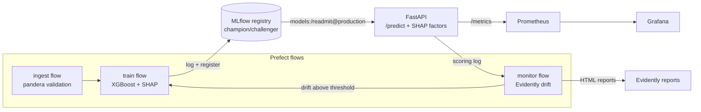

# readmit-ai — Hospital Readmission Risk, End-to-End MLOps

[](https://github.com/saisarantottempudi/readmit-ai/actions/workflows/ci.yml)
[](LICENSE)


Production-grade, open-source MLOps platform predicting **30-day hospital readmission risk** —
with the full automated lifecycle most portfolio projects skip:

**ingest → validate → train → register → serve → monitor → retrain**, one `docker compose up`.

30-day emergency readmissions cost the NHS ~£2.5B/yr and are a tracked national metric for
trusts. This project builds the *operational system around the model*: drift detection,
a governed model registry with champion/challenger promotion, per-prediction explainability,
and automated retraining that can never silently degrade the champion.

## Architecture



Eight containers: `api`, `mlflow`, `prefect`, `postgres`, `prometheus`, `grafana`,
`reports` (nginx for drift reports), `jobs` (flow runner + monitor loop). All open
source, $0, no cloud dependency.

## Quickstart (5 minutes)

```bash
git clone https://github.com/saisarantottempudi/readmit-ai && cd readmit-ai
docker compose up -d --build
# first boot: jobs container downloads UCI data, trains and promotes v1 (~3-5 min)
curl -s localhost:8000/health
```

Score a patient:

```bash
curl -s -X POST localhost:8000/predict -H 'Content-Type: application/json' -d '{
  "race":"Caucasian","gender":"Female","age":"[70-80)","admission_type_id":1,
  "discharge_disposition_id":1,"admission_source_id":7,"diag_group":"circulatory",
  "max_glu_serum":"missing","A1Cresult":">7","insulin":"Steady","change":"Ch",
  "diabetesMed":"Yes","time_in_hospital":6,"num_lab_procedures":45,"num_procedures":1,
  "num_medications":18,"number_outpatient":0,"number_emergency":1,
  "number_inpatient":2,"number_diagnoses":9}'
```

```json
{
  "risk_score": 0.6117,
  "risk_band": "high",
  "top_factors": [
    {"feature": "number_inpatient", "impact": 0.372},
    {"feature": "number_emergency", "impact": 0.111},
    {"feature": "discharge_disposition_id_1", "impact": -0.098}
  ],
  "model_version": "1"
}
```

Every prediction says *why* — top signed SHAP contributions, so a clinician can see
"3 prior inpatient stays" rather than a bare score.

## Demo the self-healing loop

```bash
pip install -e .   # host venv for the simulator
python scripts/simulate_traffic.py --n 100 --drift      # older, sicker population arrives
docker compose exec jobs python -m flows.monitor_flow   # Evidently flags drift
curl -s -X POST localhost:8000/reload                   # pick up the new champion
```

The monitor flow detects the shift, triggers retraining, and the champion/challenger
gate only promotes if the new model beats the old one on held-out AUC.

## What this demonstrates

| Concern | Implementation |
|---------|----------------|
| Data quality gates | pandera schema, leakage removal (death/hospice discharges) |
| Experiment tracking | MLflow (params, metrics, SHAP artifacts) |
| Model governance | Registry + alias, champion/challenger promotion, model card |
| Serving | FastAPI, pydantic validation, 503/422 semantics, `/reload` |
| Explainability | Per-prediction SHAP top factors, global importance artifact |
| Observability | Prometheus metrics, Grafana dashboard, structured logs |
| Drift & retraining | Evidently vs frozen reference, threshold-triggered retrain |
| Orchestration | Prefect flows (ingest / train / monitor) |
| CI/CD | ruff, mypy, pytest, docker build, Trivy scan, ghcr.io push |
| Supply-chain hygiene | Multi-stage builds, non-root containers, pinned images |

## Model

XGBoost on the UCI **Diabetes 130-US hospitals** dataset (101,766 encounters).
Held-out AUC **0.674** (published baselines: 0.65–0.69). Full intended-use,
bias and limitation notes: [docs/MODEL_CARD.md](docs/MODEL_CARD.md).
This is decision support for discharge planning — never automated care decisions.

## Repo tour

```
src/readmit/
  data/         download, pandera schema, cleaning, splits
  features/     feature list + preprocessing (shared train/serve)
  train/        pipeline, evaluation, SHAP, promotion logic
  api/          FastAPI app, schemas, model store, scoring log
  monitoring/   Evidently drift computation
flows/          Prefect flows: ingest, train, monitor
docker/         Dockerfiles + Prometheus/Grafana/postgres configs
tests/          42 tests (unit, API, drift)
docs/           MODEL_CARD.md, RUNBOOK.md, design spec + plan
```

## Operations

See [docs/RUNBOOK.md](docs/RUNBOOK.md) — service map, failure modes, demo script.

## License

MIT
